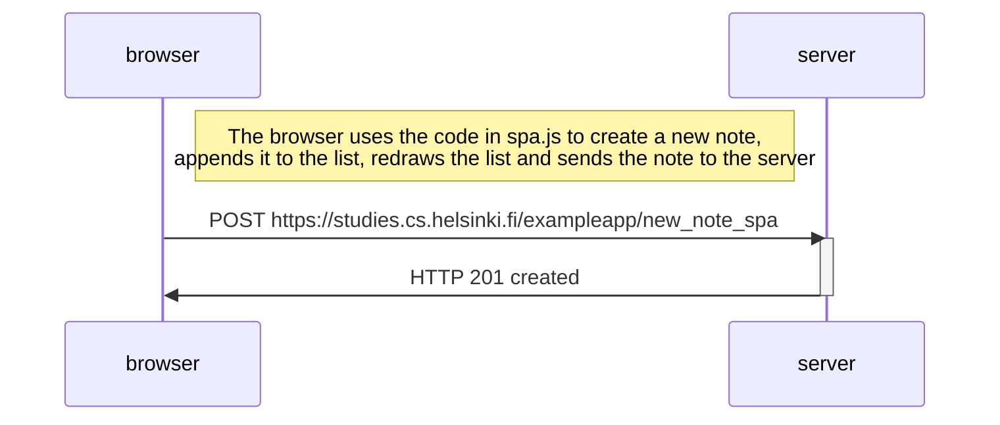

```mermaid
sequenceDiagram
    participant browser
    participant server

    Note right of browser: The browser uses the code in spa.js to create a new note,<br/> appends it to the list, redraws the list and sends the note to the server
    browser->>server: POST https://studies.cs.helsinki.fi/exampleapp/new_note_spa
    activate server
    server->>browser: HTTP 201 created
    deactivate server

```